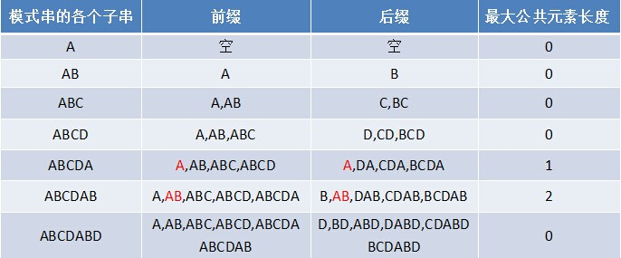

# KMP算法

## 1、简介
> **Knuth-Morris-Pratt 字符串查找算法，简称为 “KMP算法”。**  
> **这个算法由Donald Knuth、Vaughan Pratt、James H. Morris三人于1977年联合发表**

## 2、暴力匹配算法

> ~~***先上代码***~~

有一个文本串S，和一个模式串P，现在要查找P在S中的位置，怎么查找呢？

```
int ViolentMatch(char* s, char* p)  
{  
    int sLen = strlen(s);  
    int pLen = strlen(p);  
  
    int i = 0;  
    int j = 0;  
    while (i < sLen && j < pLen)  
    {  
        if (s[i] == p[j])  
        {  
            //①如果当前字符匹配成功（即S[i] == P[j]），则i++，j++      
            i++;  
            j++;  
        }  
        else  
        {  
            //②如果失配（即S[i]! = P[j]），令i = i - (j - 1)，j = 0      
            i = i - j + 1;  
            j = 0;  
        }  
    }  
    //匹配成功，返回模式串p在文本串s中的位置，否则返回-1  
    if (j == pLen)  
        return i - j;  
    else  
        return -1;  
}  
```
>举个例子，如果给定文本串S“BBC ABCDAB ABCDABCDABDE”，和模式串P“ABCDABD”，现在要拿模式串P去跟文本串S匹配，整个过程如下所示：
1. S[0]为B，P[0]为A，不匹配，执行第②条指令：“如果失配（即S[i]! = P[j]），令i = i - (j - 1)，j = 0”，S[1]跟P[0]匹配，相当于模式串要往右移动一位（i=1，j=0）  
   
2. S[1]跟P[0]还是不匹配，继续执行第②条指令：“如果失配（即S[i]! = P[j]），令i = i - (j - 1)，j = 0”，S[2]跟P[0]匹配（i=2，j=0），从而模式串不断的向右移动一位（不断的执行“令i = i - (j - 1)，j = 0”，i从2变到4，j一直为0）  
   
3. 直到S[4]跟P[0]匹配成功（i=4，j=0），此时按照上面的暴力匹配算法的思路，转而执行第①条指令：“如果当前字符匹配成功（即S[i] == P[j]），则i++，j++”，可得S[i]为S[5]，P[j]为P[1]，即接下来S[5]跟P[1]匹配（i=5，j=1）  
   
4. S[5]跟P[1]匹配成功，继续执行第①条指令：“如果当前字符匹配成功（即S[i] == P[j]），则i++，j++”，得到S[6]跟P[2]匹配（i=6，j=2），如此进行下去  
   
5. 直到S[10]为空格字符，P[6]为字符D（i=10，j=6），因为不匹配，重新执行第②条指令：“如果失配（即S[i]! = P[j]），令i = i - (j - 1)，j = 0”，相当于S[5]跟P[0]匹配（i=5，j=0）  
   
6. 至此，我们可以看到，如果按照暴力匹配算法的思路，尽管之前文本串和模式串已经分别匹配到了S[9]、P[5]，但因为S[10]跟P[6]不匹配，所以文本串回溯到S[5]，模式串回溯到P[0]，从而让S[5]跟P[0]匹配。  
   

>思考?  
>S[5]肯定跟P[0]失配。为什么呢？因为在之前第4步匹配中，我们已经得知S[5] = P[1] = B，而P[0] = A，即P[1] != P[0]，故S[5]必定不等于P[0]，所以回溯过去必然会导致失配。那有没有一种算法，让i 不往回退，只需要移动j 即可呢？


## 3、KMP来了

> KMP匹配失败不会把文本串回溯到前面，而是回溯模式串进行匹配，这样是不是就少了好多次的匹配
> ~~***再来代码***~~


```
int KmpSearch(char* s, char* p)  
{  
    int i = 0;  
    int j = 0;  
    int sLen = strlen(s);  
    int pLen = strlen(p);  
    while (i < sLen && j < pLen)  
    {  
        //①如果j = -1，或者当前字符匹配成功（即S[i] == P[j]），都令i++，j++      
        if (j == -1 || s[i] == p[j])  
        {  
            i++;  
            j++;  
        }  
        else  
        {  
            //②如果j != -1，且当前字符匹配失败（即S[i] != P[j]），则令 i 不变，j = next[j]      
            //next[j]即为j所对应的next值        
            j = next[j];  
        }  
    }  
    if (j == pLen)  
        return i - j;  
    else  
        return -1;  
}
```
> **先讲一下next数组：代表当前字符之前的字符串中，有多大长度的相同前缀后缀。例如如果next [j] = k，代表j 之前的字符串中有最大长度为k 的相同前缀后缀。**

### 首先引入几个概念
1. 最长前缀后缀，前缀后缀最长公共元素,以ABCDABD为例子。  
   
2. 前缀后缀的公共元素的最大长度表。  
   
3. ~~**失配时，模式串向右移动的位数为：已匹配字符数 - 失配字符的上一位字符所对应的最大长度值**~~ *这句话不好理解。*  
4. next数组为将最大长度表右移一位，首位填-1。  
   


>我们继续使用上面的串再次以KMP进行比较一遍（记住不回溯文本串）

1. 因为模式串中的字符A跟文本串中的字符B、B、C、空格一开始就不匹配，所以不必考虑结论，直接将模式串不断的右移一位即可，直到模式串中的字符A跟文本串的第5个字符A匹配成功：  
    
2. 继续往后匹配，当模式串最后一个字符D跟文本串匹配时失配，显而易见，模式串需要向右移动。但向右移动多少位呢？因为此时已经匹配的字符数为6个（ABCDAB），然后根据《最大长度表》可得失配字符D的上一位字符B对应的长度值为2，所以根据之前的结论，可知需要向右移动6 - 2 = 4 位。  
    
3. 模式串向右移动4位后，发现C处再度失配，因为此时已经匹配了2个字符（AB），且上一位字符B对应的最大长度值为0，所以向右移动：2 - 0 =2 位。  
       
4. A与空格失配，向右移动1 位。  
       
5. 继续比较，发现D与C 失配，故向右移动的位数为：已匹配的字符数6减去上一位字符B对应的最大长度2，即向右移动6 - 2 = 4 位。  
       
6. 经历第5步后，发现匹配成功，过程结束  
     


### 4、next数组求解过程
> ~~***再再来代码***~~

```
void GetNext(char* p,int next[])  
{  
    int pLen = strlen(p);  
    next[0] = -1;  
    int k = -1;  
    int j = 0;  
    while (j < pLen - 1)  
    {  
        //p[k]表示前缀，p[j]表示后缀  
        if (k == -1 || p[j] == p[k])
            next[++j] = ++k;
        else   
            k = next[k];  
    }  
}  
```

举个例子 字符串ABAC 模式串ABAB   

|字符|A|B|A|B|  
|---|---|---|---|---|  
|最大长度表|0|0|1|2|  
|next数组|-1|0|0|1|  

|文本串|A|B|A|***C***|  
|---|---|---|---|---|  
|模式串|A|B|A|***B***|  


B和C不匹配，模式串进行右移 3 - next[3] = 2 位    

|文本串|A|B|A|***C***| | | 
|---|---|---|---|---|---|---| 
|模式串| | |A|***B***|A|B|

 

此时B和C依旧不匹配，命名知道P[3]和P[1]相同，还进了一次额外的比较，next数组可以进行优化。

优化后的代码
```

void GetNext(char* p, int next[])  
{  
    int pLen = strlen(p);  
    next[0] = -1;  
    int k = -1;  
    int j = 0;  
    while (j < pLen - 1)  
    {  
        //p[k]表示前缀，p[j]表示后缀    
        if (k == -1 || p[j] == p[k])  
        {  
            if (p[j+1] != p[k+1])  
                next[++j] = ++k;   //之前只有这一行  
            else
                next[++j] = next[++k];  
        }  
        else  
        {  
            k = next[k];  
        }  
    }  
}
```


优化后的next数组 -1 0 -1 0 ,因为P[3]和P[1] 相同 ，P[2]和P[0] 相同，他们的next数组置为一样。


